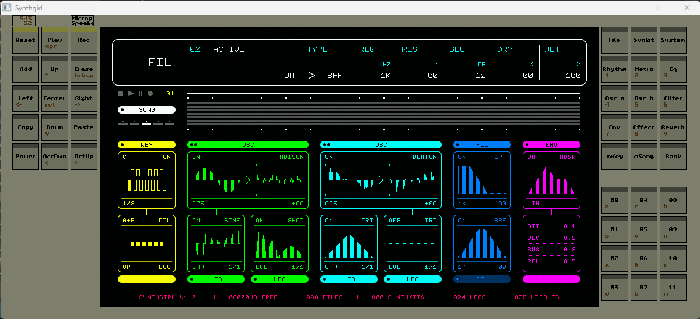

# Synthgirl-emu

Unofficial Synthgirl port to pc.

## Build steps:

- clone this repo
- update repo submodules `git submodule update --init --recursive`
- (Windows) install [MSYS2](https://www.msys2.org/), and open MINGW64
  - Install packages: `gcc cmake SDL2 libserialport portaudio portmidi` (`sh mingw-prepare_env.sh` can be used for automatic installation)
- (Ubuntu) `sudo apt install cmake pkg-config libsdl2-dev libserialport-dev libportmidi-dev portaudio19-dev`
- move to App folder `cd 02\ Software/Synthgirl-App-H723`
- build `sh cmake_clean_build.sh`
- run `./build-cmake/emu/Emu`
  - virtual SD card folder path is set in `panel_conf.h` - see `FF_VOLUME_ROOT`. You may need to change it (and rebuild) if you plan to run app outside of this repo. Now it is relative to the CWD (the folder from which the application is launched)
  - (Windows MINGW) to run app outside MINGW environment, you may need to manually copy libraries from it

